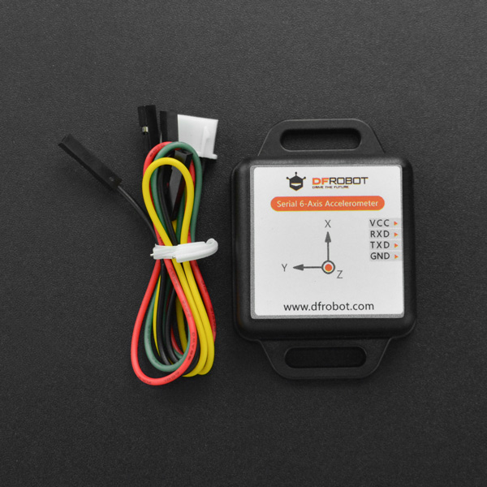

# DFRobot_WT61PC
* [中文版](./README_CN.md)

- This module integrates high-precision gyroscopes, accelerometer, microprocessor of high-performance 
and advanced dynamics solves and Kalman filter algorithms that aim to quickly solve the current real-time 
movement of the module attitude.
- The data output frequency of sensor can be revised since it uses serial communication.
- The sensor measured data include acceleration, angular velocity and angle of x, y, and z.




## Product Link (https://www.dfrobot.com/product-2200.html)

  SKU: SEN0386


## Table of Contents

* [Installation](#installation)
* [Methods](#methods)
* [History](#history)
* [Credits](#credits)


## Summary

* Retrieve sensor data (acceleration: 3 axes, angular velocity: 3 axes, angle: 3 axes) through the UART interface.


## Installation

To use this library, first download the library file, paste it into the \Arduino\libraries directory, then open the examples folder and run the demo in the folder.


## Methods

```C++

  /**
   * @fn DFRobot_WT61PC
   * @brief Constructor 
   * @param Stream Software serial port interface 
   * @return None
   */
  DFRobot_WT61PC(Stream *s);

  /**
   * @fn available
   * @brief  Check if there is data to read 
   * @return Return true, data avaiable to read; false, no data to read 
   */
  bool available(void);

  /**
   * @fn modifyFrequency
   * @brief Revise the data output frequncy of sensor
   * @param frequency - FREQUENCY_0_1HZ for 0.1Hz, FREQUENCY_0_5HZ for 0.5Hz, FREQUENCY_1HZ for 1Hz, 
   * @n                 FREQUENCY_2HZ for 2Hz, FREQUENCY_5HZ for 5Hz, FREQUENCY_10HZ for 10Hz, 
   * @n                 FREQUENCY_20HZ for 20Hz, FREQUENCY_50HZ for 50Hz, FREQUENCY_100HZ for 100Hz, 
   * @n                 FREQUENCY_125HZ for 125Hz, FREQUENCY_200HZ for 200Hz.
   * @return None
   */
  void modifyFrequency(uint8_t frequency);

```

## Compatibility

| MCU           | Work Well | Work Wrong | Untested | Remarks |
| ------------- | :-------: | :--------: | :------: | ------- |
| Arduino uno   |     √     |            |          |         |
| Mega2560      |     √     |            |          |         |


## History

- 2023/07/12 - Version 1.0.0 released.


## Credits

Written by huyujie(yujie.hu@dfrobot.com), 2020. (Welcome to our [website](https://www.dfrobot.com/))

